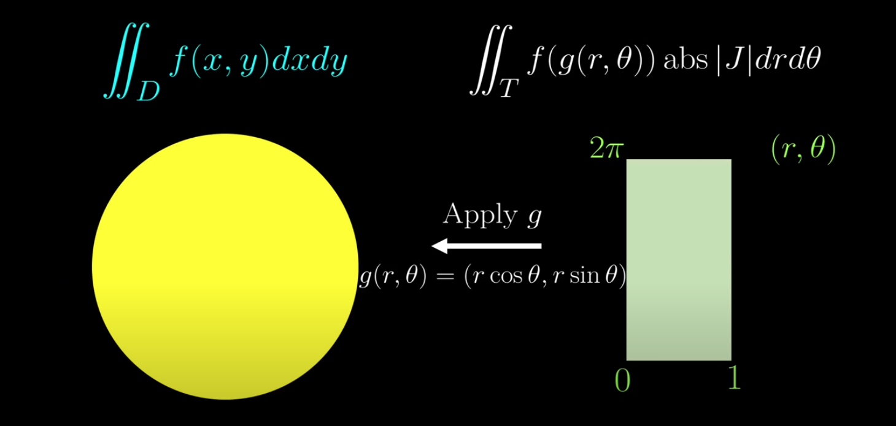
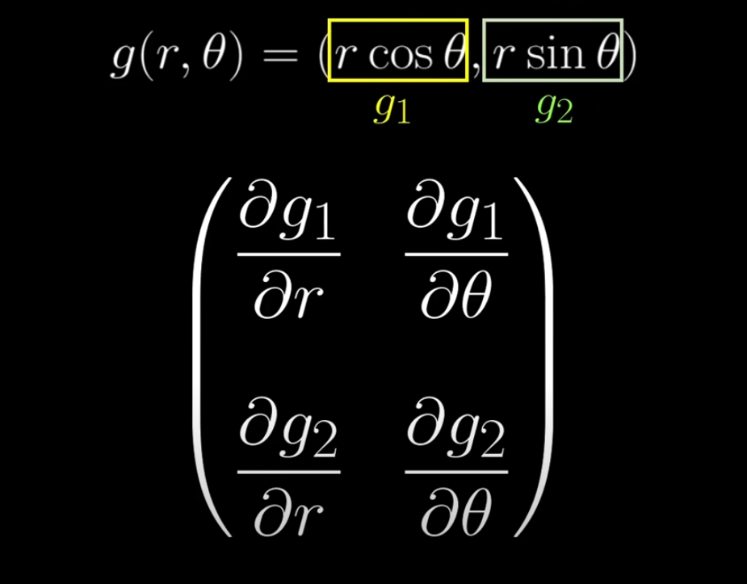

https://www.youtube.com/watch?v=wCZ1VEmVjVo  
https://en.wikipedia.org/wiki/Jacobian_matrix_and_determinant  

 

Jacobian matrix is the matrix representing best linear map approximation of function(f) near the point(a,b).  
linear map also can think as determinant or the scaling factor for areas.  
Jacobian deterninant: how much areas scale near point(a, b).  

  

  

  