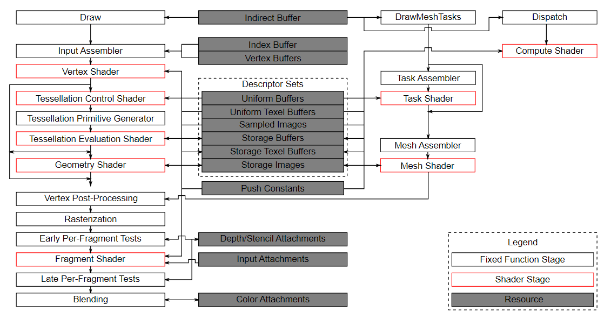
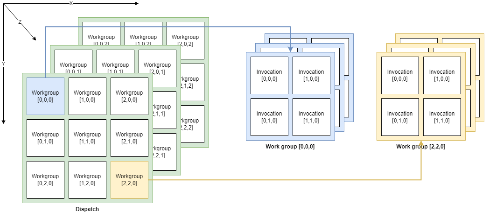

## overview
- how to draw a triangle  
  - Instance and physical device selection  
  VkInstance | VkPhysicalDevice  

  - Logic device and queue families  
  VkDevice | VkQueue  

  - Window surface and swap chain  
  create a window to present rendered images to.  
  render to a window with VkSurfaceKHR | VkSwapchainKHR.  
  VkSurfaceKHR:  
    vulkan api is completely platform agnostic, so to use the standardized WSI(Window System Interface) extension to interact with the window manager.  
    the surface is a cross-platform abstraction over window to render to.  
    generally instantiated by providing a reference to the native window handle.  

  VKSwapchainKHR:  
    swap chain is a collection of render targets. to ensure the image that currently rendering to is different from the one that is currently on the screen.
    draw a frame we have to ask the swap chain to provide us with an image to render to. when finished drawing a frame, the image return to the swap chain, then to be present to the screen at some point.  
    the number of render target and conditions for presenting finished images to the screen depend on the present mode(eg. double buffering(vsync) or triple buffering).  

  - Image views and framebuffers  
  to draw to an image acquired from the swap chain, warp it into a VkImageView and VkFramebuffer.  
  an image view reference a specific part of an image to be used.  
  a framebuffer references image views that are to be used for color,depth,and stencil targets.  

  - Render passes  
  describe the type of images, how they will be used, how their contents should be treated. VkFramebuffer actually binds specific images to these slots.  

  - Graphic pipeline  
  VkPipeline object.  
  describe configurable state of the graphics card, like the viewport size and depth buffer operation and the programmable state using VkShaderModule objects.  
  VkShaderModule objects are created from shader byte code.  
  the driver alse needs to know which render targets will be used in the pipeline, which we specify by referencing the render pass.  
  have to create many VkPipeline objects in advance for all the different combinations you need for your rendering operations.  
  only some basic configuration, like viewport size and clear color, can be changed dynamically.  

  - Command pools and command buffers  
  VkCommandBuffer | VkCommandPool  

  - Main loop  
  first acquire an image from swap chain with vkAcquireNextImageKHR.  
  then select the appropriate command buffer for the image and execute it with vkQueueSubmit.  
  finally, return the image to the swap chain for presentation to the screen with vkQueuePresentKHR.  
  operations that are submitted to queues are executed asynchronously. have to use synchronization objects like semaphores to ensure a correct order of execution.  
  execution of the draw command buffer must be set up to wait on image acqussition to finish.  
  the vkQueuePresentKHR call in turn needs to wait for rendering to be finished, for which use a second semaphore that is signaled after rendering completes.  

  - validation layers  
  do things like running extra checks on function parameters and tracking memory management problems.  

## drawing
### Frame buffers
    在render pass创建期间指定的attachments,通过将其封装进VkFramebuffer对象中来绑定. 一个framebuffer object引用所有表达此attachments的VkImageView objects.  

### Command buffers
    将所有需执行的操作记录到command buffer objects. 所有的commands可以一起提交， Vulkan能更有效率的处理这些commands,允许在多线程记录command.  
    VkCommandPool | vkCreateCommandPool | vkDestroyCommandPool  
    command buffers通过提交它们至device queue中的一个来执行. 每个command pool 仅分配提交到单个类型queue的command buffers.  
    VkCommandBuffer | vkAllocateCommandBuffers  
    vkBeginCommandBuffer  
    vkCmdBeginRenderPass  
    vkCmdBindPipeline  
    vkCmdSetViewport | vkCmdSetScissor (可动态设置pipeline的viewport state和scissor state)  
    vkCmdDraw  
    vkCmdEndRenderPass  
    vkEndCommandBuffer  

### Rendering and Presentation
##### outline of a frame
等待前一帧结束  
向swap chain请求一张图片  
记录一个command buffer, 用来绘制场景至图片  
提交 recorded command buffer  
present the swap chain image  

##### synchronization
GPU上的同步执行是显式的。操作的顺序需使用各种synchronization primitives来告知驱动我们想要运行的顺序。因许多Vulkan API的调用在GPU上是异步执行的， 函数的返回早于其操作结束.  
这里需要一些order explicitly, 因在GPU上的异步执行:  
    acquire an image from the swap chain.  
    execute commands that draw onto the acquired image.  
    present that image to the screen for presentation, returning it to the swapchain.  

##### semaphores
semaphore用于在queue operation之间添加顺序.既可以是同一个queue，也可以是不同queues.  
vulkan中有两种类型的semaphores: binary 和 timeline  
binary semaphore可以是unsignaled或signaled. 初始为unsignaled.如vkQueueSubmit,但这些都是是GPU waiting.  
VkSemaphore | vkCreateSemaphore | vkDestroySemaphore  

##### fences
CPU wait, CPU上的顺序执行，也是用于synchronize execution.  
Fences必须手动重置以回到unsignaled状态.因fences用于控制host的执行，host可以决定何时重置fence.  
fences用于保持CPU和GPU彼此同步.  
VkFence | vkCreateFence | vkDestroyFence | vkWaitForFences | vkResetFences  

##### flow
vkWaitForFences | vkResetFences:  create a fence for wait previous frame finish  
vkAcquireNextImageKHR: acquire an image from the swap chain  
vkResetCommandBuffer  
record a command buffer  
vkQueueSubmit  

vkDeviceWaitIdle  

##### subpass dependencies
render pass中的subpasses会自动处理image layout transitions.这些转换由subpass dependencies控制，指定内存和subpasses之间的执行依赖.  
有两个内置依赖负责处理render pass开始和结束时的transition.但前一个没有发生在正确的时间。 假定transition发生在pipeline的开始处，但此时还没有acquire the image.  
有两种解决方式,设置waitStages为VK_PIPELINE_STAGE_TOP_OF_PIPE_BIT / VK_PIPELINE_STAGE_COLOR_ATTACHMENT_OUTPUT_BIT.  

##### VkPipelineStageFlagBits
VK_PIPELINE_STAGE_TOP_OF_PIPE_BIT  
VK_PIPELINE_STAGE_DRAW_INDIRECT_BIT  
VK_PIPELINE_STAGE_VERTEX_INPUT_BIT  
VK_PIPELINE_STAGE_VERTEX_SHADER_BIT  
VK_PIPELINE_STAGE_TESSELLATION_CONTROL_SHADER_BIT  
VK_PIPELINE_STAGE_TESSELLATION_EVALUATION_SHADER_BIT  
VK_PIPELINE_STAGE_GEOMETRY_SHADER_BIT  
VK_PIPELINE_STAGE_FRAGMENT_SHADER_BIT  
VK_PIPELINE_STAGE_EARLY_FRAGMENT_TESTS_BIT  
VK_PIPELINE_STAGE_LATE_FRAGMENT_TESTS_BIT  
VK_PIPELINE_STAGE_COLOR_ATTACHMENT_OUTPUT_BIT  
VK_PIPELINE_STAGE_TRANSFER_BIT  
VK_PIPELINE_STAGE_BOTTOM_OF_PIPE_BIT  
VK_PIPELINE_STAGE_HOST_BIT  
VK_PIPELINE_STAGE_ALL_GRAPHICS_BIT  
VK_PIPELINE_STAGE_ALL_COMMANDS_BIT  
VK_PIPELINE_STAGE_NONE  
VK_PIPELINE_STAGE_TRANSFORM_FEEDBACK_BIT_EXT  
VK_PIPELINE_STAGE_CONDITIONAL_RENDERING_BIT_EXT  
VK_PIPELINE_STAGE_ACCELERATION_STRUCTURE_BUILD_BIT_KHR  
VK_PIPELINE_STAGE_RAY_TRACING_SHADER_BIT_KHR  
VK_PIPELINE_STAGE_FRAGMENT_DENSITY_PROCESS_BIT_EXT  
VK_PIPELINE_STAGE_FRAGMENT_SHADING_RATE_ATTACHMENT_BIT_KHR  
VK_PIPELINE_STAGE_COMMAND_PREPROCESS_BIT_NV  
VK_PIPELINE_STAGE_TASK_SHADER_BIT_EXT  
VK_PIPELINE_STAGE_MESH_SHADER_BIT_EXT  

## Computer Shader
image manipulation, visibility testing, post processing, advanced lighting calculations, animations, physicals...
offloading work from the CPU / not requiring moving data between the CPU's main memory and the GPU's memory, all of the data can stay on the GPU / highly parallel workflows with tens of thousands of small compute units
 

 

- Shader storage buffer objects(SSBO)
arbitrarily read from and write to buffers. similar to using uniform buffer objects. the biggest differences are that you can alias other buffer types to SSBOs and that can be arbitrarily large.
SSBO can contains an unbound number of objects. 
such as particle in the tutorial, we need to deal with vertices being updated(written) by the compute shader and read(drawn) by the vertex shader, as both usages would seemingly require diffrent buffer types.
so we specify multiple usages for the buffer in vulkan, the particle vertex buffer to be used as a vertex buffer(in the graphics pass VK_BUFFER_USAGE_VERTEX_BUFFER_BIT ) and as a storage buffer(in the compute pass VK_BUFFER_USAGE_STORAGE_BUFFER_BIT ).
also need VK_BUFFER_USAGE_TRANSFER_DST_BIT, used to transfer data from the host to the GPU. so the shader storage buffer can stay in GPU memory only(VK_MEMORY_PROPERTY_DEVICE_LOCAL_BIT).

- Compute queue families
VK_QUEUE_COMPUTE_BIT
dedicated compute queue, which hints at an asynchronous compute queue
synchronization mechanisms

- Descriptors
VK_SHADER_STAGE_COMPUTE_BIT

- Compute pipelines
vkCreateComputePipelines
vkCreatePipelineLayout

- Compute space
work groups and invocations define an abstract execution model for how compute workloads are processed by the compute hardware of the GPU in three dimensions(x,y,z).
Work groups define how the compute workloads are formed and processed by the compute hardware of the GPU. work group dimensions are set by the application at command buffer time using a dispatch command.
each work group is a collection of invocations that execute the same compute shader. Invocations can potentially run in parallel and their dimensions are set in the compute shader. invocations within a single workgroup have access to shared memory.
 

 

the number of dimensions for work groups(defined by vkCmdDispatch) amd invocations (defined by the local size in the computer shader) depends on how input data is structed.
for instance, dispatch a work group count of [64,1,1] with a computer shader local size of [32,32,1], the computer shader will be invoked 64x32x32 = 65536 times.

also constraints in maxComputeWorkGroupCount, maxComputeWorkGroupInvocations and maxComputeWorkGroupSize in VkPhysicalDeviceLimits.
