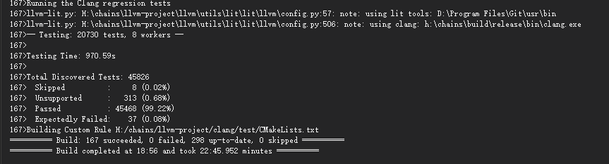
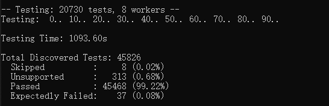
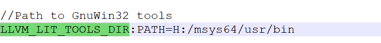

# 下载资源 llvm-project
git clone --config core.autocrlf=false https://github.com/llvm/llvm-project.git
  
git clone --config core.autocrlf=false https://mirrors.tuna.tsinghua.edu.cn/git/llvm-project.git  
  
// 签出 如 llvm 19.1.6 release version  
git checkout -b llvm-19.1.6 llvmorg-19.1.6  
  
  
# 构建llvm.sln
cmake -DCMAKE_CXX_FLAGS="/utf-8" -DLLVM_ENABLE_PROJECTS=clang -DLLVM_LIT_TOOLS_DIR="H:\msys64\usr\bin"  -G "Visual Studio 17 2022" -DCMAKE_BUILD_TYPE=Release  -A x64 -Thost=x64 ..\llvm-project\llvm  
  
(build和llvm-project 位于同一层)  
  
# clang and llvm : release x64
msbuild ALL_BUILD.vcxproj /V:m /p:Platform=x64 /p:Configuration=Release /t:rebuild  
  
# test for clang
python llvm-project\llvm\utils\lit\lit.py -sv --debug --param=build_mode=Release build\tools\clang\test  
参数参考:https://llvm.org/docs/CommandGuide/lit.html  
  
visual studio和command line的编译结果:  
  
  
  
  

# 遇到的编译问题

### 问题1
H:\llvm-project-llvmorg-19.1.6\llvm-project\clang\lib\Lex\UnicodeCharSets.h(397,1): error C2226: syntax error: unexpected type 'llvm::sys::UnicodeCharRange' [H:\llvm-project-llvmorg-19.1.6\build\tools\clang\lib\Lex\clangLex.vcxproj]  
H:\llvm-project-llvmorg-19.1.6\llvm-project\clang\lib\Lex\UnicodeCharSets.h(397,69): error C2143: syntax error: missing ';' before '{' [H:\llvm-project-llvmorg-19.1.6\build\tools\clang\lib\Lex\clangLex.vcxproj]  
H:\llvm-project-llvmorg-19.1.6\llvm-project\clang\lib\Lex\UnicodeCharSets.h(397,69): error C2447: '{': missing function header (old-style formal list?) [H:\llvm-project-llvmorg-19.1.6\build\tools\clang\lib\Lex\clangLex.vcxproj]  

H:\llvm-project-llvmorg-19.1.6\llvm-project\clang\lib\Lex\Lexer.cpp(1549,59): error C2665: 'llvm::sys::UnicodeCharSet::UnicodeCharSet': no overloaded function could convert all the argument types [H:\llvm-project-llvmorg-19.1.6\build\tools\clang\lib\Lex\clangLex.vcxproj]  
H:\llvm-project-llvmorg-19.1.6\llvm-project\clang\lib\Lex\Lexer.cpp(1578,9): error C2065: 'C11AllowedIDCharRanges': undeclared identifier [H:\llvm-project-llvmorg-19.1.6\build\tools\clang\lib\Lex\clangLex.vcxproj]  
H:\llvm-project-llvmorg-19.1.6\llvm-project\clang\lib\Lex\Lexer.cpp(1618,59): error C2665: 'llvm::sys::UnicodeCharSet::UnicodeCharSet': no overloaded function could convert all the argument types [H:\llvm-project-llvmorg-19.1.6\build\tools\clang\lib\Lex\clangLex.vcxproj]  
  
#### 解决方法
https://github.com/llvm/llvm-project/issues/60549  
-DCMAKE_CXX_FLAGS="/utf-8"   确保MSVC将源码文件视为UTF-8编码  

### 问题2 缺少组件
适用于最新v143生成工具的C++ ATL(x86 和 x64)

### 问题3 msys2替代GnuWin32
-DLLVM_LIT_TOOLS_DIR="H:\msys64\usr\bin"  
需要的工具有cmp.exe,grep.exe,sed.exe,diff.exe,echo.exe  
若不配置路径, 会通过注册表查询GitForWindows, 使用git的usr/bin路径  
  
路径配置缓存在CMakeCache.txt  
  
  

### 问题4
lit.py: H:\chains\llvm-project\llvm\utils\lit\lit\TestingConfig.py:157: fatal: unable to parse config file 'H:\\chains\\llvm-project\\clang\\test\\lit.cfg.py', traceback: Traceback (most recent call last):  
  File "H:\chains\llvm-project\llvm\utils\lit\lit\TestingConfig.py", line 145, in load_from_path exec(compile(data, path, "exec"), cfg_globals, None)  
  File "H:\chains\llvm-project\clang\test\lit.cfg.py", line 33, in <module> config.test_format = lit.formats.ShTest(not llvm_config.use_lit_shell)  
                                                ^^^^^^^^^^^^^^^^^^^^^^^^^  
AttributeError: 'NoneType' object has no attribute 'use_lit_shell'  
  
#### 解决方法
这是因为llvm_config没有加载. 我们需要的测试用例的配置lig.cfg.py是位于bulid/tools/clang/test/lit.site.cfg.py, 而不是llvm-project/clang/test/lit.cfy.py.  
