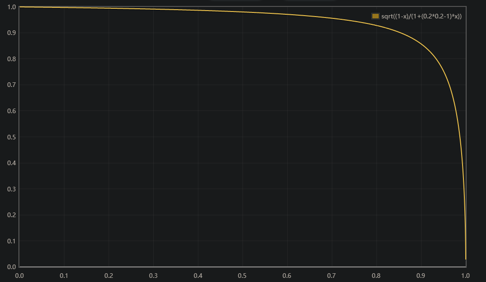
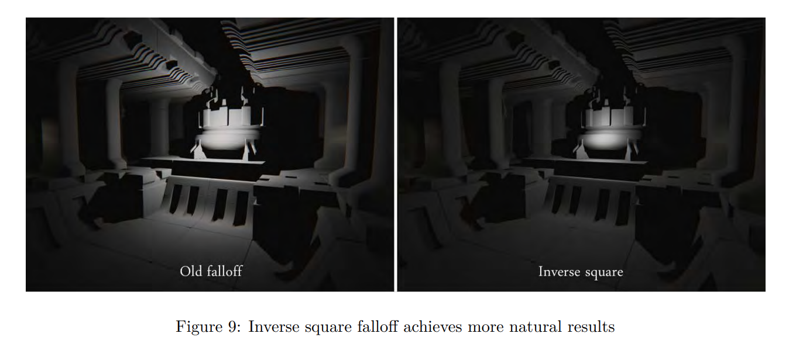

[UE4 PBR -- Brian Karis -- 2013](https://de45xmedrsdbp.cloudfront.net/Resources/files/2013SiggraphPresentationsNotes-26915738.pdf)

# Real Shading in UE4

- 目标
  - 实时性能: 同一时间许多可见光的使用是高效的.
  - 减少复杂度: 尽可能少的参数; 为了切换使用 image-based lighting 和 analytic light sources, 参数在横跨所有光照类型时必须行为一致.
  - 直观的接口: 更喜欢简单理解的值, 而不是物理值如折射率.
  - 线性的感知: 希望支持 layering through masks, 但仅提供每像素一次着色. 则参数混合的着色必须尽可能接近着色结果的混合.
  - 易于掌控: 避免对dielectrics和conductors的技术理解, 最小的努力需求来创建基础的物理令人满意的材质.
  - Robust: 很难错误创建物理不满意的材质, 所有参数的组合尽可能是鲁棒的和满意的.
  - 富于表现的: 延迟着色限制了shading model的数量,因此基础shading model需尽可能覆盖真实世界的材质; 分层材质需共享同一组参数,为了能混合.
  - 灵活的: 允许non-photorealistic rendering

  <br/>

## Shading Model
  - Diffuse BRDF

    评估Burley的diffuse model, 相较于Lambertian diffuse(1), 仅有较小的差异. 此外,任何更复杂的diffuse model都很难更有效率的用于image-base或spherical harmonic lighting.

    $$f(l, v) = \frac{c_{diff}}{\pi}   \qquad   (1) $$

    ${c_{diff}} 是材质的diffuse \ albedo.$ <br>
    $除\pi是因为漫反射部分从BRDF中剥离出来时,需抵消积分计算结果值中的\pi$
    <br>

  - Microfacet Specular BRDF
  
    Cook-Torrance microfacet specular shading model:

    $$f(l, v) = \frac{D(h)F(v, h)G(l,v,h)}{4(n{\cdot}l)(n{\cdot}v)} \qquad (2) $$
    <br>

  - Specular D
  
    normal distribution function(NDF)采用Disney选择的 GGX/Trowbridge-Reitz, 与Blinn-Phong相比, 额外费用相当小. 外观有很长的拖尾(tail). 也采纳Disnery的重新参数化 ${\alpha} = {Roughness^2} $.

    $$D(h) = \frac{\alpha^2}{\pi((n\cdot h)^2(\alpha^2 - 1) + 1)^2} \qquad (3) $$
    <br>

  - Specular G
  
    specular geometric attenuation选择了Schlick model. 但 $k = \alpha / 2$,以更好的适应GGX的Smith model. 在此修改下, Schlick model可在 $\alpha = 1$ 时精确匹配Smith, 并在[0,1]范围内相当接近.
    Disney通过重新映射roughness为 $\frac{Roughness + 1}{2}$ 来减少"hotness". 但此调节仅用于 analytic light sources. 若应用于image-based lighting, 则在glancing angles的结果会十分暗淡.   <br/>

    $$k = \frac{(Roughness + 1)^2}{8} (for \ analytic \ light \ sources / direct \  lighting) $$  

    $$k = \frac{Roughness^2}{2} (for \ image-based \ lighting) $$

    $$G_1(v) = \frac{\vec{n} \cdot \vec{v}}{(\vec{n} \cdot \vec{v})(l - k) + k} $$

    $$G(l,v,h) = G_1(l)G_1(v)  \qquad  (4) $$

    <br/>

    

    <br/>

  - Specular F
  
    Fresnel 使用Schlick's approximation. 但有细微的修改: 使用 Spherical Gaussian approximation来替换power( $(1 - (h \cdot v))^5$ ). 计算效率更高一些,差别也看不出来.
    
    $$F(v,h) = F_0 + (1 - F_0)2^{(-5.55473(\vec{v} \cdot \vec{h}) - 6.98316)(\vec{v} \cdot \vec{h})} \qquad (5) $$
    
    $F_0 是 the \ specular \ reflectance \ at \ normal \ incidence$
    <br/>

  - Image-Based Lighting
  
    为了将shading model和image-based lighting一起使用, radiance integral需要被解析, 一般使用importance sampling. 以下方程式描述此数值积分:
  
    $$\int_H L_{i} f(l,v) cos\theta_l dl \approx \frac{1}{N} \sum_{k=1}^{N}  \frac{L_i(l_k)f(l_k,v)cos\theta_{l_k}}{p(l_k,v)} \qquad (6) $$

    (import sampling 体现在只有视角方向正好是入射光方向的反射方向,才会通过采样. 根据GGX分布方程式,使用球面坐标来生成需要的法线H)<br>
    通过使用mip maps可以显著减少采样数. 但采样数仍需要大于16以确保质量.但ue为了local reflections,混合了许多environment maps,因此实际仅每一个单个采样.
    <br/>

    [Hammersley Knowleges](../Math/low-discrepancySequence.md)

    ```c++
    float3 ImportanceSampleGGX( float2 Xi, float Roughness, float3 N )
    {
        float a = Roughness * Roughness;

        float Phi = 2 * PI * Xi.x;
        // 如何推导出costheta的呢???
        float CosTheta = sqrt( (1 - Xi.y) / (1 + (a*a - 1) * Xi.y ));
        float SinTheta = sqrt( 1 - CosTheta * Costheta );

        //左手坐标系 球面坐标系->笛卡尔坐标系
        float3 H;
        H.x = SinTheta * cos(Phi);
        H.y = SinTheta * sin(Phi);
        H.z = CosTheta;

        float3 UpVector = abs(N.z) < 0.999 ? float3(0,0,1) : float3(1,0,0);
        float3 TangentX = normalize( cross(UpVector, N) );
        float3 TangentY = cross( N, TangentX );

        //tanget to world space
        return TangentX * H.x + TangentY * H.y + N * H.z;
    }

    float3 SpecularIBL( float3 SpecularColor, float Roughness, float3 N, float3 V )
    {
        float3 SpecularLighting = 0;

        const uint NumSamples = 1024;
        for ( uint i = 0; i < NumSamples; i++ )
        {
            float2 Xi = Hammersley( i, NumSamples );
            float3 H = ImportanceSampleGGX( Xi, Roughness, N );
            float3 L = 2 * dot( V, H ) * H - V;

            float NoV = saturate( dot( N, V ) );
            float NoL = saturate( dot( N, L ) );
            float NoH = saturate( dot( N, H ) );
            float VoH = saturate( dot( V, H ) );

            if ( NoL > 0 )
            {
              float3 SampleColor = EnvMap.SampleLevel( EnvMapSampler, L, 0 ).rgb;

              float G = G_Smith( Roughness, NoV, NoL );
              float Fc = pow( 1 - VoH, 5 );
              float3 F = (1 - Fc) * SpecularColor + Fc;

              // Incident light = SampleColor * NoL
              // Microfacet specular = D*F*G / (4*NoL*NoV)
              // pdf = D * NoH / (4* VoH) (这是如何推导的???)
              SpecularLighting += SampleColor * F * G * VoH / (NoH * NoV);
            }
        }
    }
    ```

      

    <br/>

  - Split Sum Approximation
  
    将上述的近似求和分割成两部分.每部分的求和可以预计算.此近似对于constant $L_i(l)$ 是精确的,对于common environment十分精确.

    $$\frac{1}{N} \sum_{k=1}^{N} \frac{L_i(l_k)f(l_k,v) cos \theta_{l_k}}{p(l_k, v)} \approx (\frac{1}{N} \sum_{k=1}^{N}L_i(l_k)) (\frac{1}{N} \sum_{k=1}^{N} \frac{f(l_k, v)cos \theta_{l_k}}{p(l_k, v)}) \qquad (7) $$
    <br/>

  - Pre-Filtered Environment Map
  
    为不同的roughness来预计算第一个求和,结果存储在mip-map levels of a cubemap.相对其他游戏工业所使用的此方法,有个小的区别.即使用importance sampling将着色模型的GGX分布和environment map进行卷积.<br>
    既然这是个微面元模型,分布的形状变化是基于到表面的viewing angle,因此假定此角度为零,即 n = v = r. 此 isotropic假设是近似的第二个来源. 这样做意味着无法获得lengthy reflections at grazing angles. 相比较split sum approximation, 这实际上是IBL解决方案的很大错误来源. 以下的代码可发现 $cos \theta_{l_k}$的加权可获取更好的结果.

    ```HLSL
    float3 PrefilterEnvMap( float Roughness, float3 R )
    {
      float3 N = R;
      float3 V = R;

      float3 PrefilteredColor = 0;

      const uint NumSamplers = 1024;
      for ( uint i = 0; i < NumSamples; i++ )
      {
        float2 Xi = Hammersley( i, NumSamplers );
        float3 H = ImportanceSampleGGX( Xi, Roughness, N );
        float3 L = 2 * dot( V, H ) * H - V;

        float NoL = saturate( dot( N, L ) );
        if ( NoL > 0 )
        {
          PrefilteredColor += Envmap.SampleLevel( EnvMapSampler, L, 0 ).rgb * NoL;
          TotalWeight += NoL;
        }
      }

      return PrefilteredColor / TotalWeight;
    }

    ```

    <br>

  - Environment BRDF
  
    第二个求和和带有solid-white environment的specular BRDF积分一样. 即 $L_i(l_k) = 1$. 通过代入 Schlick's Fresnel: $F(v, h) = F_{0} + (1 - F_0)(1 - v·h)^5 $, $F_0$可以分离出此积分.

    $$\int_H f(l, v) cos\theta_l dl = F_0 \int_H \frac{f(l, v)}{F(v, h)} (1 - (1 - v·h)^5) cos\theta_l dl + \int_H \frac{f(l, v)}{F(v, h)} (1 - v·h)^5 cos\theta_l dl \qquad  (8)$$

    此积分有两个输入(Roughness | $cos \theta_v$)和两个输出(scale and bias to $F_0$), 每个的范围都在[0, 1]内. 预计算此函数的结果并存储在2D look-up texture(LUT)中.

    ```HLSL
    float2 IntegrateBRDF( float Roughness, float NoV )
    {
      float3 V;
      V.x = sqrt( 1.0f - Nov * NoV ); //sin
      V.y = 0;
      V.z = NoV;                      // cos

      float A = 0;
      float B = 0;

      const uint NumSamples = 1024;
      for ( uint i = 0; i < NumSamples; i++ )
      {
        float2 Xi = Hammersley( i, NumSamples );
        float3 H = ImportanceSampleGGX( Xi, Roughness, N );
        float3 L = 2 * dot( V, H ) * H - V;

        float NoL = saturate( L.z );
        float NoH = saturate( H.z );
        float VoH = saturate( dot( V, H ) );

        if (NoL > 0)
        {
          float G = G_Smith( Roughness, NoV, NoL );

          float G_Vis = G * VoH / (NoH * NoV);
          float Fc = pow( 1 - VoH, 5 );
          A += (1 - Fc) * G_Vis;
          B += Fc * G_Vis;
        }
      }

      return float2( A, B ) / NumSamples;
    }

    ```

    ```HLSL
    float3 ApproximateSpecularIBL( float3 SpecularColor, float Roughness, float3 N, float3 V )
    {
      float NoV = saturate( dot( N, V ) );
      float3 R = 2 * dot( V, N ) * N - V;

      float3 PrefilteredColor = PrefilterEnvMap( Roughness, R );
      float2 EnvBRDF = IntegrateBRDF( Roughness, NoV );

      return PrefilteredColor * ( SpecularColor * EnvBRDF.x + EnvBRDF.y );
    }

    ```
<br>

## Material Model
限制参数的数量对于optimizing G-Buffer space, reducing texture storage and access, and minimizing the cost of blending material layers in the pixel shader都十分重要.

base material model:<br>
BaseColor<br>
Metallic<br>
Roughness<br>
Cavity: small-scale shadowing<br>

Cavity用于指定远小于运行时shadowing system所能处理的几何的阴影. 经常是由于此几何仅在法线贴图上出现. 如地板之间的裂缝或衣服的接缝.<br>
Specular 默认值是0.5(对应于4% reflectance). 有效使用Specular的情况几乎都在small scale shadowing. index of refraction(IOR)对于nonmetals十分不重要,因此最近将Specular替代为更容易理解的Cavity参数. 非金属的$F_0$是常量值0.04.  (但目前UE5.1,依然有Specular. 用于non-metallic surfaces, Cavity不存在?)<br>

special cases:<br>
Subsurface: 以不同方式对shadow maps采样<br>
Anisotropy: 需要许多IBL采样<br>
Clearcoat: 需要两个IBL采样<br>
Sheen<br>

当前采用的延迟着色中,使用存储在G-Buffer中的shader model id的动态分支来处理不同的着色模型 (在UE5.1中, Anisotropy已经是基础材质球参数, sheen不存在于shading model)

## Material Layering
https://dev.epicgames.com/documentation/en-us/unreal-engine/using-material-layers-in-unreal-engine

material attributes holds all of the materials output data. can be passed in and out of material functions as single pin, passed along wires, and outputted directly.
艺术家通过将mesh分离为多个sections来解决in-shader layering限制,导致更多的draw calls.
使用dynamic branching来减少layer已经100%覆盖区域的着色器消耗还未调研.
we wish to improve the artist interface to the library of material layers by making it easier to find and preview layers. we also intend to investigate an offline compositing/baking system in addition to out current run-time system, to support a larger number of layers and offer better scalability.

## Lighting Model
和着色一样,希望通过更加基于物理的制作来改进光照模型. 有两个关注的领域--light falloff 和 non-punctual sources of emission(area lights).
light falloff: 采用物理精确的inverse-square falloff 并切换到the photometric brightness unit of lumens( the unit of luminous flux). 一个小问题是此衰减函数没有达到零的距离(即无限趋近于零). 但出于实时和离线计算的效率, 也需要人为的限制光照的影响范围. 我们以这样一种方式对平方反比函数做窗口处理,使得大部分光的衰减保持相对不受影响,仍提供到零的柔和过渡.

$$falloff = \frac{saturate(1 - (distance / lightRadius)^4)^2}{diatance^2 + 1} \qquad (9)  $$

分母上的+1是为了阻止函数靠近光源处爆炸.



<br>


## Area Lights
在离线渲染中,常见的解决方案是从光源表面的许多点发光--uniform sampling或者importance sampling.但对实时渲染是不切实际的.
一个近似的算法需满足一下的需求:<br>
  材质外观的连续性: diffuse BRDF和Specular BRDF的能量计算量不能显著不同.<br>
  在solid angle接近零时,需接近point light model<br>
  执行足够快<br>

- Billboard Reflections<br>
  Billboard reflections是IBL的一种形式,可用于discrete light sources. 可以存储emitted light的2D图片,映射到3D空间的一个矩形上.
  类似于environment map prefiltering, 此图片为不同尺寸的specular distribution cones进行pre-filtered.
  从图片上计算specular shading可以认为是cone tracing的一种形式, 每个cone近似specular NDF. 圆锥体中心的射线与billboard的平面相交.在图像空间的相交点可用做纹理坐标,在相交处圆锥体的半径可用于推导一个近似的pre-filtered mip level. 
  虽然图像可以以直接方式来表达十分复杂的area light sources, 但billboard reflections有多个原因不能满足第二个需求. 图像在平面上进行pre-filtered, 因此在图像空间中能够表示的solid angle是有限的. 当射线不和平面相交时便没有数据. light vector是未知的或者假设为reflection vector.
  <br>
 
- Cone Intersection<br>
  cone tracing 不需要pre-fitering, 可以解析的完成. 
  intersected the cone with a disk facing the shading point by Drobot. A polynomial approximating the NDF is then piece-wise integrated over the intersecting area.
  但使用cone,specular distribution必须是radially symmetric. 这会排除stretched highlights, 这是微面元镜面反射模型的十分重要的特征. 此外类似于billboard reflections,没有定义着色模型需要的light vector.
  <br>
  
- Specular D Modification<br>
  基于光源的solid angle来修改specular distribution. 背后的理论是,对于相应的cone angle,将光源的分布视为和D(h)一样. 一个分布和另一个的卷积可以近似为将两个cone angle相加以推导出一个新的cone.因此将来自等式3的$\alpha$转换为有效的cone angle, 加上光源的角度. 得到一下近似:

  $$\alpha' = saturate(\alpha + \frac{sourceRadius}{3*distance}) \qquad (10)  $$

  效率足够了,但不满足第一个需求.因为非常glossy materials在large area lights照射时会显得十分粗糙. 但很适合如Blinn-Phone这样的specualr NDF.

  

  <br>

- Representative Point<br>
  如果对于一个特定的着色点, 我们可以将来自area light的所有光视为来自光源表面的一个representative point,便可以直接使用着色模型. 一个合理的选择是largest distribution point.
  但能量守恒一直没有处理. 通过移动发射光的原始点,可以有效增加光源的solid angle,但并没有补偿额外的能量. 校正比dividing by solid angle稍微复杂一些,因为能量差异取决于specular distribution. 例如为rough material改变入射光朝向将会导致非常小的能量变化,但对于glossy material,此能量变化会非常巨大.

  <br>
  
  <br>

- Sphere Lights<br>
  若球体位于地平线之上,sphere light的Irradiance等价于一个point light. 虽然反直觉,但如果我们接受球体位于地平线之下的不精确性,便可以仅解决specular lighting.
  我们通过找到距ray最短距离的点来近似找到与reflection ray最小角度的点.

  $$centerToRay = L - (L \dot r)r$$
  $$closestPoint = L + centerToRay * saturate(\frac{sourceRadius}{|centerToRay|})  \qquad  (11)$$
  $$l = ||closestPoint||$$

  L是着色点到光源中心的向量, sourceRadius是光源球体的半径, r是reflection vector.
  当射线和球体相交时,计算的点将会是射线到球体中心最近的点,一旦归一化便唯一.

  通过移动发射光的原点到球体的表面,通过球体的对角可以有效扩大specular distribution.尽管不是microfacet distribution,使用normalized Phong distribution可以更好的解释.

  $$I_{point} = \frac{p + 2}{2\pi} cos^p \phi_r \qquad (12) $$

  $$\begin{equation*} I_{sphere} = \begin{cases}
        \frac{p + 2}{2\pi} & if \  \phi_r < \phi_s \\
        \frac{p + 2}{2\pi} cos^p(\phi_r - \phi_s) & if \ \phi_r \ge \phi_s
      \end{cases}
    \end{equation*}  \qquad (13)
  $$

  $\phi_r$是r和L的夹角, $\phi_s$是sphere对角的一半.
  $I_{point}$是归一化, 意味着在半球体上的积分结果是1.
  $I_sphere$显然不是标准化,取决于power p, 积分结果会非常大.
  <br>

  为了近似能量的增加, 应用specular D modification所描述的相同缘由, 基于光的立体角(solid angle)来扩大分布. 为wider distribution使用normalization factor,替换原有的normalization factor. 对于GGX,此normalization factor是 $\frac{1}{\pi\alpha^2}$. 为the representative point操作推导出近似的normalization, 将新的加长normalization factor除以原来的:

  $$SphereNormalization = (\frac{\alpha}{\alpha'})^2 \qquad  (14) $$

  representative point方法的结果符合所有需求. 通过校正修复能量守恒,无论光源的尺寸大小,materials行为一样. glossy materials仍产生sharp-edged specular highlights, 因此仅修改BRDF的输入即可, 着色模型不受影响.
  
  <br>

- Tube Lights<br>
  sphere lights可用于表达light bulbs, tube lights(capsules)可用于表达florescent lights.
  求解具有长度但半径为零的tube lights, 即linear lights. line segment的Irradiance可以解析积分,只要线段位于地平线之上:

  $$\int_{L_0}^{L_1} \frac{n \cdot L}{|L|^3} dL = \frac{ \frac{n \cdot L_0}{|L_0|} + \frac{n \cdot L_1}{|L_1|} }{|L_0||L_1| + (L_0 \cdot L_1)} \qquad (15) $$

  $L_0$和$L_1$是着色点到线段两端的向量.

  修改方程式以阻止负irradiance,除0,当长度为零时匹配point light falloff:
  
  $$irradiance = \frac{ 2 * saturate(\frac{n \cdot L_0}{2|L_0|} + \frac{n \cdot L_1}{2|L_1|}) }{|L_0||L_1| + (L_0 \cdot L_1) + 2} \qquad (16)$$

  对于linear light specular,需求解方程式中的t:
  $$L_d = L_1 - L_0 \\
  l = || L_0 + saturate(t)L_d ||          \qquad (17)
  $$

  Picott寻找到到达r最小角度的t:
  
  $$t = \frac{(L_0 \cdot L_d)(r \cdot L_0) - (L_0 \cdot L_0)(r \cdot L_d)} {(L_0 \cdot L_d)(r \cdot L_d) - (L_d \cdot L_d)(r \cdot L_0)}   \qquad (18) $$

  类似sphere事例, 可以近似最小角, 替代为最短距离:

  $$t = \frac{(r \cdot L_0)(r \cdot L_d) - (L_0 \cdot L_d)}{|L_d|^2 - (r \cdot L_d)^2}   \qquad (19) $$

  edge cases没有恰当的处理,因此并不总是能找到最近点. 但此近似计算廉价且产生的效果相比等式18也看的过去.

  方程式18和19将r视为线段,而不是射线, 这两种解决方案都不能恰当的处理远离线段的射线.这会引发从一个端点到另一个的突兀变化,即使是完美的平面也会如此. 这会发生在当reflection rays从指向光到远离光的过渡.可以通过在计算点和每个端点之间选择来修复,但过于昂贵.可以简单接受此瑕疵.
  
  为了能量守恒,可以应用球体光的相同概念. specular distribution通过光的对角来扩大,但这次是一维的,因此可以使用GGX的anisotropic版本. anisotropic GGX的normalization factor是 $\frac{1}{\pi\alpha_x\alpha_y}$,当 $\alpha_x=\alpha_y=\alpha $时便是isotropic

  $$LineNormalization = \frac{\alpha}{\alpha'}  \qquad (20) $$

  因为仅改变光的原点和应用了能量守恒,这些操作是可以累加的. line segment和sphere这样做,近似于形状的卷积,很好的模拟了tube light的行为.

  

  <br>

  附带能量守恒的representative point方法可以有效的用于简单形状.未来可应用于spheres和tubes外的其他形状.特别是应用于textured quads以表达更复杂和多颜色的光源.

  <br>
