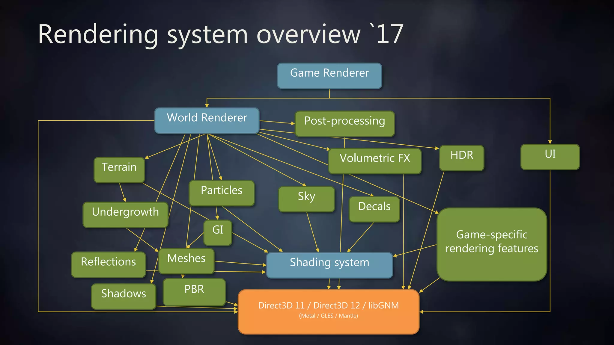
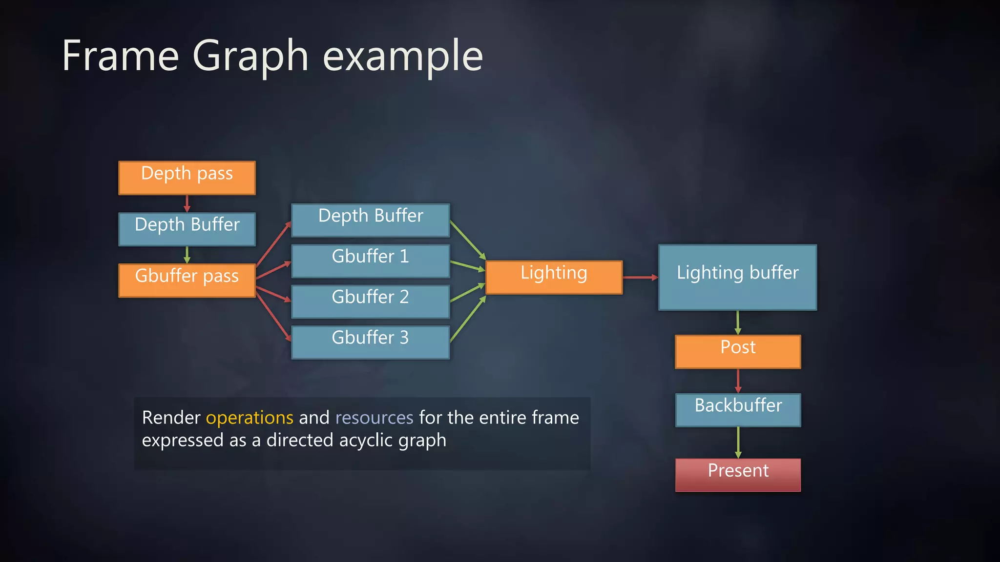

[RDG 101 A Crash Course](https://epicgames.ent.box.com/s/ul1h44ozs0t2850ug0hrohlzm53kxwrz)
[github staticJPL RDG](https://github.com/staticJPL/Render-Dependency-Graph-Documentation/blob/main/Render%20Dependency%20Graph%20(RDG).md)
[Frame Graph](https://www.slideshare.net/DICEStudio/framegraph-extensible-rendering-architecture-in-frostbite)
[Rendering Passes](https://unrealartoptimization.github.io/book/profiling/passes/)
[Frame Graph](https://zhuanlan.zhihu.com/p/639001043)
[RDG UE5.4](https://dev.epicgames.com/documentation/en-us/unreal-engine/render-dependency-graph-in-unreal-engine)
[RDG 0-0](https://www.cnblogs.com/timlly/p/15217090.html)
[CUDA](https://developer.nvidia.com/blog/cooperative-groups)
[SIMT](https://docs.nvidia.com/cuda/cuda-c-programming-guide/index.html#simt-architecture)

 

- [RenderGraph.h](#rendergraphh)
- [RDG from staticJPL](#rdg-from-staticjpl)
- [Frame Graph from frostbite](#frame-graph-from-frostbite)
- [Render Dependency Graph](#render-dependency-graph)
    - [RDG Programming Guide](#rdg-programming-guide)
    - [Debugging and Validation](#debugging-and-validation)
- [RDG Source Code(UE5.1)](#rdg-source-codeue51)
    - [RDG Resources](#rdg-resources)
    - [Descriptor](#descriptor)
    - [Transient Resource](#transient-resource)
    - [RDGPass](#rdgpass)
    - [FRDGBuilder](#frdgbuilder)
    - [RDG 机制](#rdg-机制)

<small><i><a href='http://ecotrust-canada.github.io/markdown-toc/'>Table of contents generated with markdown-toc</a></i></small>

 

  

 

### RenderGraph.h
    RDG framework 设置 lambda scopes, 设计为passes通过延迟执行来将GPU commands发送到RHI.  
    pass由FRDGBuilder::AddPass()创建, 需要shader parameters, framework更感兴趣地是render graph resources.  
    FRDGBuilder::AllocParameter()来分配持有所有pass parameter的结构体.  

    因lambda的延迟执行需要确保正确地lifetime.  
    render graph resources由FRDGBuilder::CreateTexture()/CreateBuffer()来创建. 仅记录resource descriptor.  
    只有在资源需要时才会由graph来allocation. graph会追踪资源地生命周期, 当剩余地pass不再引用时,可以释放或重复使用此资源内存.  

    pass中使用地所有render graph resources必须位于FRDGBuilder::AddPass()上地pass parameters中. 这样render graph可以知道资源正在被哪个pass使用
    resources仅保证在executing passes时会被allocated. 因此仅在pass的lambda scope对参数进行访问  

    不要在parameters中引用超过pass需要的graph resources  

    pass execution中的lambda scope可能发生在FRDGBuilder::AddPass()之后的任意时间. 出于调试目的,可以使用immediate mode让其发生在AddPass()中.
    即命令行参数 -rdgimmediate 或 r.RDG.ImmediateMode=1  

    Pooled管理的resource texture可通过FRDGBuilder::RegisterExternalTexture()来在render graph中使用  

    execution会优先考虑不同的硬件目标,如内存压力或pass GPU并发执行. 因此passes的执行顺序无法保证  

    render graph pass不应该修改外部数据结构体的状态. render graph resources使用FRDGBuilder::QueueTextureExtraction()提取.  

### RDG from staticJPL
- RDG resources  
    render graph管理资源的生命周期(graph/transient resources), 对应不受管理的有external resources  
    transient resources的生命周期关联 resource aliasing(DX12)  
    resource aliasing: 不同资源在不同时间使用相同的内存, 即允许多个资源共享相同内存.(DX12 Resource Barriers)  
    Build cross-queue synchronization - dependency tree - GPU fence  

- RDG dynamics  
    Setup: PassName/Pass Parameters(shader parameter struct)/Pass Flags/Pass logic(lambda function)  
    Compile: 清除未引用但定义的resources/passes, resources lifetime, resources allocation, 构建优化过的资源转换图  

    Running/Execute: 执行RDG pass的lambda function. 设置pipeline state objects/shaders/resource bindings,发送copy/draw/dispatch命令及发送render commands至command list.  
    copy command: 数据传输(CPU->GPU/GPU->GPU/GPU->CPU)  
    draw command: 几何渲染(graphic pipeline)  
    dispatch command: 密集型计算,如physics simulation/particle system等(compute pipeline)  

    shaderType: FGlobalShaser/FMaterialShader  
    shader parameters: FShaderParameter/FShaderResourceParameter/FRWShaderParameters/TShaderUniformBufferParameter  
    使用宏来自定义shader parameter struct(uniform buffer)  
    alignment需求(16-byte自动对齐)  
    绑定shader  
    设置parameters  
    Global uniform buffer  

     
    
    
  
     

### Frame Graph from frostbite
- rendering system  
      

    - new architectural components  
       

    全知的一帧: 资源管理/渲染管线配置/异步计算和资源屏障  
    self-contained和更有效率的渲染模块  
    可视化和调试复杂的渲染管线  

      

     

- frame graph phase  
    - setup  
        定义render/compute passes  
        定义每个pass的输入和输出资源(rdg resource/external resource)  
        类似于瞬时模式渲染的代码流  
    - compilation  
        剔除未引用的resources和passes  
        计算 resource lifetimes  
        分配GPU resources  
    - execution  
        执行每个render pass的callback function  
        即刻模式渲染代码: RenderContext API/设置state,resources,shaders/Draw,Dispatch  
        获取在设置阶段处理生成的 real GPU resources  
    - 优势  
        延迟创建资源/resource aliasing  
        Async compute(main queue/async queue)和sync point(resource barrier)和resource lifetime  
        Pass的C++声明使用lambda: 节省代码流, 对遗留代码的最小化改动(resource struct - setup - deferred execute)  

- transient resource  
        临时资源的实现依赖于平台的兼容性: aliasing physical memory(XB1)/ aliasing virtual memory(DX12/PS4) / object pools(DX11)  
        buffers: atomic linear allocator  
        textures: memory pools  
        memory aliasing - aliasing barrier  

### Render Dependency Graph
    将render commands记录到graph data structure以便编译和执行的即时API  
    自动化易出错操作, 遍历图像以优化内存使用和并行化render passes  

    调度asynchronous compute fences  
    拥有最优生命周期和memory aliasing的transient resources的分配  
    使用split-barriers转换子资源,以隐藏延迟和改进GPU的重叠情况  
    并行命令列表记录  
    剔除图形中未使用的资源和passes  
    验证api使用和资源依赖  
    在RDG Insights中图形结构体和内存生命周期的可视化  

##### RDG Programming Guide
- Shader Parameter Structs  
    RDG通过对shader parameters struct系统的扩展来表达graph dependencies  
    通过着色器参数结构体的声明宏, 这些宏生成等价的c++数据结构以及编译时的反射元数据(reflection metadata)  
    metadata允许运行时遍历结构体, 这对动态绑定参数至RHI很有必要.(name/c++ type/HLSL type/byte offset)  
    RDG依赖于metadata来遍历pass parameters  

  - Shader Bindings  
        派生自FGlobalShader  
        DECLARE_GLOBAL_SHADER  
        SHADER_USE_PARAMETER_STRUCT: 生成此类的constructor,将FParameter绑定注册到FShader instance  
        BEGIN_SHADER_PARAMETER_STRUCT/END_SHADER_PARAMETER_STRUCT  
        将参数结构体声明为通用的FParameters  
        通过实例化结构体,将shader parameters绑定到RHI command list, SetShaderParameters函数提交  

  - Uniform Buffer  
        组合着色器参数至RHI resource, 可作为FParameters的一个成员  
        声明BEGIN_UNIFORM_BUFFER_STRUCT/END_UNIFORM_BUFFER_STRUCT  
        实现IMPLEMENT_UNIFORM_BUFFER_STRUCT: 向shader system注册uniform buffer定义,并生成HLSL定义  
        Uniform buffer parameter通过shader compiled自动生成.在HLSL中使用UniformBuffer.Member来访问  
        SHADER_PARAMTER_STRUCT_REF: 可将uniform buffer作为一个参数加入到parent shader parameter struct.  

    - static Bindings  
        每个shader的shader parameters是唯一绑定的, 每个shader stage(如vertex/pixel)需要自己的shader parameters.  
        shaders通过Set{Graphics, Compute}PipelineState在RHI command list中作为PSO绑定到一起.  
        在command list中绑定pipeline state,会无效化所有的shader bindings, 因此shader parameters 在设置PSO之后绑定.  

        MeshDrawCommands在多个passes和views中是可以缓存和共享的, 每帧为每个pass/view生成唯一一组draw commands是无效率的.  
        且MeshDrawCommand也需要知道pass/view的uniform buffer resources, 以便绑定到它们. 因此static binding model被用于UniformBuffers.  

        在static bindings声明下,uniformBuffer 直接绑定到RHI command list上的static slot, 而不是绑定到每个单独shader的unique slot.  
        当shader请求uniform buffer时, command list会直接从static slot 提取绑定信息.  
        此时绑定发生在pass frequency,而不是PSO frequency. 因此允许每个draw call从command list继承shader bindings.  

    - Defining Static Uniform Buffers  
         IMPLEMENT_STATIC_UNIFORM_BUFFER_STRUCT |  IMPLEMENT_STATIC_UNIFORM_BUFFER_SLOT  
         多个static uniform buffers定义可以引用同一个static slot, 但一次只能绑定一个. 尽可能重复使用slots以减少slot的总数量.  
         RHICmdList.SetStaticUniformBuffers: RDG在执行每个pass之前,会自动将static uniform buffer绑定到command list. 任何static uniform buffer应该包含在pass parameter struct.  

- Render Graph Builder  
    - 实例化 FRDGBuilder instance, 创建resources和add passes以设置图. 之后调用FRDGBuilder::Execute来编译和执行graph  
    - FRDGBuilder::CreateTexture/FRDGBuilder::CreateBuffer, 这些方法仅分配descriptors,底层的RHI resources将在后面的执行阶段分配  
    - FRDGBuilder::AddPass, 指定pass parameter struct,将 可执行的lambda作为参数  
        - Pass parameter structs扩展shader parameter structs, 参数可包含 RDG resources  
        - RDG使用这些参数推导图中各passes间的依赖, transient resources的生命周期  
        - GraphBuilder::AllocParameters 分配pass parameters, 并分配在execute lambda中使用的所有相关的RDG resources.  
        - Pass execute lambda记录了在图形执行期间需要提交到RHI command list的工作  
            FRHIComputeCommandList / FRHICommandList, FRHICommandListImmediate 可用于pass执行期间需求creation/locking RHI resources.  

    - Setup and Execute Timelines  

          
     

- RDG Utilities Functions(RenderGraphUtils.h) 如FComputeShaderUtils::AddPass /FPixelShaderUtils::AddFullscreenPass  

- RDG Resources and Views  
  RDG resource初始包含RHI resource descriptor.  
  关联的RHI resource仅可在resource作为pass parameter的成员, 在pass的execution lambda中访问.  
  所有的RDG resources提供FRDGResource::GetRHI来重载特定的子类型.此方法严格限制在pass lambdas内访问.  
  Buffer resources和Texture resources的属性: Transient和External.  
    Transient resource: 生命周期限制在graph中,内存也可能与其他具有不相交生命周期的transient resource共同占有(memory alias).  
    External resource: 生命周期扩展出graph,发生在用户将已存在的RHI resource注册到图中或者在执行阶段完成时将resources提取出图.  
  Shader Resource View(SRV): 仅可读  
  Unordered Access View(UAV): 支持读写, 且可并发  
  RDG resource pointer被Graph Builder所持有.在销毁后变成无效的. 任何指针在图执行阶段完成后都应该为空.  

- Passes 和 Parameters  
  FRDGBuilder::AllocParameters: Pass parameters使用AllocParameters函数来分配,以确保正确的内存生命周期. RDG用自己的宏扩展 shader parameter struct system.  
  FRDGBuilder:AddPass: 消耗自定义的RDG macros, 同时忽略shader parameter macros.  
  联结pass parameters和shader parameters, 引擎中大部分的pass parameters也是shader parameters.  

  - RDG是shader parameter struct system的扩展  
  没有RDG参数的着色器参数结构体: 可以直接实例化,即刻在RHI command list上设置着色器和着色器参数结构体(SetShaderParameters)等  
  附带RDG参数的着色器参数结构体: 必须通过FRDGBuilder::AllocParameters创建再初始化. FRDGBuilder:AddPass, 将passParameters和lambda函数作为参数,延迟执行在RHI command list上设置shader和shader parameters等.  
  没有shader parameters的Pass parameters: pass和shader不是一一对应或不涉及shader时十分有用, 如CopyTexture.  

  - Raster Passes  
    RDG通过RENDER_TARGET_BINDING_SLOTS参数为raster pass 暴露固定函数的render targets.  
    RHI利用render passes将render targets绑定到command list.  

    - Load Actions  
    binding color/depth/stencil target需要特定的Load Actions. 这些行为为每个target控制初始像素值.  
    Tiled rendering hardware 需要精确的行为来获取最佳性能.  
    Load: 保留纹理已有的内容  
    Clear: optimized clear value  
    NoAction: 可能不保留内容. 若所有有效像素被写入,则在一些硬件上会快一些.  

    - UAV Raster Passes  
    raster pass 输出到UAV, 替代固定函数的render targets.  
    FPixelShaderUtils::AddUAVPass创建没有render targets的自定义render pass, 且绑定RHI viewports  

    - Resources Dependency Management  
    向FRDGBuilder::AddPass提供的pass parameter struct中存在RDG resources时,resouce lifetime可能会延长, 可能和先前的pass创建依赖关系.  
    挑战在于shader决定了resource是否被使用, 因shader的排列组合可能编译出resource或者引入新的.  
    ClearUnusedGraphResources: 清除shader不再使用的资源  

    - Mipmap Generation Example  
    对raster pass和compute pass都可生成mipmap chain,可以用SRV或UAV将多个pass串联  

    - Asynchronous Compute  
    RDG通过检查graph dependencies和在synchronization points处插入fences来支持异步计算调度.  
    FComputeShaderUtils::AddPass  

    - External Resources(lifetime)  
    resource注册进graph 或者 从graph中提取  
    FRDGBuilder::RegisterExternal{Texture, Buffer} | IPooledRenderTarget  | FRDGPooledTexture  
    GraphBuilder.QueueTextureExtraction  

    - Alternative Approach: Convert to External  
    适用于无法等待到graph的末尾来提取资源的情形.  
    conversion 将生命周期延长到graph的起始, extraction延长至graph的末尾.  
    则此资源不可和这一帧中其他的资源共享底层分配.  

- Transient Resource  
相较于默认的resource pool方法, 实施transient allocator的平台可以获得显著的GPU memory watermark减少. (memory aliasing)  
resource pool 会强制比较和匹配RHI descriptors以决定重复使用. 而transient allocator可以共享底层内存  

- RDG Uniform Buffers  
SHADER_PARAMETER_RDG_UNIFORM_BUFFER  

- Upload Buffers  
FRDGBuilder::QueueBufferUpload : RDG resource在执行graph之前需要从CPU初始化数据.  
RDG 在graph编译期间批量上传, 且可能与其他编译任务重叠工作.  
使用RDG执行上传: 一个手动的lock/unlock使用pass的即时command list,会引入sync point和抑制parallel execution  
上传的buffers会自动标记为non-transient. transient resources不支持CPU uploads.  
ERDGInitialDataFlags: 若数据的生命周期能生存到graph deferral就使用NoCopy, 否则让RDG来copy一份.  

- Memory Lifetimes  
setup和execution的时间线是分割的, 因此处理memory lifetimes要小心.  
POD types: FRDGBuilder::AllocPOD (不调用destructor)  
C++ object: FRDGBuilder::AllocObject (调用destructor)  
raw memory: FRDGBuilder::Alloc  
RDG pass parameters: FRDGBuilder::AllocParameters (可能执行额外的tracking)  
任何分配的内存会持久到graph builder instance被销毁. 这些分配的内存使用linear allocator.  

- Performance Profiling  
RDG_EVENT_SCOPE: RenderDoc或者RDG Insights  
RDG_GPU_STAT_SCOPE: stat gpu  
RDG_CSV_STAT_EXCLUSIVE_SCOPE: CSV profiler  

- Conventions  
用点分隔来为resource构造namespace. 如TSR.History.ScreenPercentage  
命名graph builder instance: GraphBuilder  
命名内联在shader instance上的shader parameters: FParameters  
使用RDG_EVENT_SCOPE 作为passes的命名空间  
尽可能使用 RenderGraphUtils.h | ScreenPass.h  

##### Debugging and Validation
RDG Immediate Mode: r.RDG.ImmediateMode(控制台变量) 或者 -rdgimmediate(命令行参数)  
r.RHICmdBypass 禁止parallel rendering和software command list  
在Immediate Mode下, 所有图形优化会禁止,包括 transient allocation, graph culling, render pass merging等  

CVars来单个禁止RDG特性:  
r.RDG.CullPasses  
r.RDG.MergeRenderPasses  
r.RDG.ParallelExecute  
r.RDG.TransientAllocator (默认为resource pooling)  

- Validation Layer  
Debug/Development builds下运行.  

- Resource Transition Debugging  
RDG Transition Log: -rdgtransitionlog 或者 r.rdg.transitionlog X | r.RDG.Debug.ResourceFilter [ResourceName] | r.RDG.Debug.PassFilter PassName  
RHI Transition Log: -rhivalidation 和 -rhivalidationlog=ResourceName  
RDG从Render Thread打印transitions, RHI从RHI Thread打印transition logs, 可使用-norhithread -forcerhibypass 或者 -onethread  

- Visualize Texture  
vis command  

- Transient Allocator Debugging  
r.RDG.ClobberResources  
r.RDG.Debug.ExtendResourceLifetimes  
r.RDG.Debug.DisableTransientResources  

- RDG Insights Plugin  
resource lifetime/pass associations/resource pool allocation overlap  
asynchronous compute fences and overlap  
graph culling and render pass merging  
parallel execution pass ranges  
transient memory layouts  

- Capturing a Trace  
Live Trace in Unreal Insights: -trace=rdg,defaults  

### RDG Source Code(UE5.1)

- thread group size:  warp in Nvidia | wave in GCN  
group size的理想尺寸是8x8, 占用至少一个完整的wave(GCN), 两个warp(Nvidia).  
Nvidia:  
在GPU的SIMT(Single Instruction Multiple Thread)架构中, GPU streaming multiprocessors(SM)在以32个线程为一组称为warps来执行线程指令.  
在一个SIMT warp中的线程都是相同类型,开始于相同的程序地址,但可以自由分支和独立执行.  
latency hiding: warps可以通过调度,当某个warp在等待内存访问时,其他warp被调度来运行指令.  
 

- SIMT 架构:  
    multiprocessor 以32个并行线程(warps)为一组来创建,管理,调度,执行线程.  
    组成warp的各个线程在同一个program address一起启动,但拥有自己的instruction address counter/register state,因此可以自由分支和独立执行.  
    给multiprocessor提供一个或多个thread blocks来执行, multiprocessor将thread blocks划分至warps, 每个warp通过warp scheduler来被调度执行.  
    block总是以一样的方式划分至warps, 每个warp包含连续的threads, 提升thread IDs, 其第一个warp包含thread 0. Thread Hierarchy(thread IDs关联block中的thread indices).  
    每个warp每次执行一条通用指令, 若warp的32条线程都同意其执行路径,则可实现完全效率. 若warp的线程经由数据相关的条件分支出现分歧, warp执行所采用的每个分支路径, 禁止不在该路径上的线程. 分支分歧(branch divergence)仅发生在warp内.  
    Independent Thread Scheduling: 允许线程之间的完全并发, 无论warp是哪个.  
    active threads: warp中的线程若参与当前指令  
    inactive(disabled): 相较于warp中的其他线程过早退出/分支分歧/block中的线程数量不是warp size的倍数了.  
 

##### RDG Resources
  - FRDGResource  
    - ResourceRHI: RHI资源引用  
    - bIsActuallyUsedByPass: 运行时追踪资源是否被pass的lambda使用,以检测不必要的资源依赖  
    - bAllowRHIAccess: 追踪pass执行期间,底层的RHI resource是否允许被访问  
  - FRDGUniformBuffer  
    - ParameterStruct: RDG参数结构体  
    - UniformBufferRHI: RHI资源  
    - Handle: RDG句柄  
    - bQueuedForCreate  
  - TRDGUniformBuffer 模板类  
  - FRDGViewableResource 由图跟踪分配生命周期的render graph resource,可能有引用它的子资源(如views)  
    - Type: 资源类型Texture/Buffer  
    - bExternal: 外部资源  
    - bExtracted: 在图执行的末期,处于队列中以提取的资源  
    - ReferenceCount: 当引用计数为0时可以剔除  
    - bProduced: 先前的pass是否为此资源添加到graph produced contents.外部资源不会考虑produced,直到用于写入操作. 这是所有subresources的联合体, 因此任意子资源的写入都会设置为true.  
    - DefaultEpilogueAccess  
    - AccessModeState: RHIAccess/RHIPipeline/AccessMode/bLocked/bQueued  
    - bTransient: 通过transient resource allocator分配的资源  
    - bForceNonTransient: TransientExtractionHint  
    - bLastOwner: 此资源是否为分配的最后持有者. 在执行时间戳之后再不分配别名(aliases)  
    - bQueuedForUpload  
    - FirstBarrier: 若为true, 资源会跳过prologue split barrier,立即执行转换(transition)  
    - FirstPass  
    - LastPass  
    - EpilogueAccess: 在图结尾处的资源状态  
    - DeallocatedReferenceCount  
    - PassStateIndex: 设置中时为pass中的资源分配的临时索引  
    - TraceOrder  
    - TracePasses  
    - ViewableDebugData: FirstProducer/PassAccessCount/bHasBeenClobbered  
  - FRDGView: 引用单个viewable resource(如 a texture/buffer)的渲染图资源.提供抽象方式来访问可视资源  
    - Type: 子资源类型 TextureSRV/TextureUAV/BufferSRV/BufferUAV  
    - Handle  
    - LastPass  
  - FRDGTexture: 继承自FRDGViewableResource, 渲染图追踪的Texture  
    - StaticType  
    - Desc: FRDGTextureDesc->FRHITextureDesc 构造函数  
    ETextureDimension: Texture2D/Texture2DArray/Texture3D/TextureCube/TextureCubeArray  
    ETextureCreateFlags: renderTarget/resolve target/depth-stencil target/shader resource/sRGB gamma space ...  
    - Flags: ERDGTextureFlags  
    - NextOwner: 在执行期间拥有PooledTexture分配的下一个texture  
    - Handle: builder上注册的句柄  
    - Layout: 用于促成子资源转换的布局  
    - WholeRange  
    - SubresourceCount  
    - RenderTarget: 执行期间使用的分配的render target. 从不重置  
    - PooledTexture或者TransientTexture  
    - ViewCache: 为此贴图分配的view cache(源文件来自transient/pooled texture). 从不重置  
    - Allocation: 持有强引用时严格有效. 使用PooledRenderTarget替代  
    - State: 在图构建时追踪子资源状态  
    - MergeState: 在图构建时追踪合并的子资源状态  
    - LastProducers: 在图构建时为每个子资源追踪pass producers  
  - FRDGShaderResourceView: 继承自FRDGView, 渲染图追踪的SRV  
  - FRDGUnorderedAccessView: 继承自FRDGView  
    - Flags: ERDGUnorderedAccessViewFlags  
  - FRDGTextureSRV: 继承自FRDGShaderResourceView, 渲染图追踪的SRV  
    - StaticType  
    - Desc: FRDGTextureSRVDesc, Descriptor:   
  - FRDGTextureUAV: 继承自FRDGUnorderedAccessView  
    - StaticType  
    - Desc: FRDGTextureUAVDesc  
  - FRDGBuffer: 继承自FRDGViewableResource  
    - FRDGBufferDesc Desc  
    - ERDGBufferFlags Flags  
    - Handle  
    - NextOwner: 在执行期间分配的持有pooledBuffer的下个buffer  
    - PooledBuffer和TransientBuffer的联合体  
    - ViewCache  
    - Allocation  
    - State  
    - MergeState  
    - LastProducer  
    - NumElementsCallback: 在此FRDGBuffer创建之后支持NumElements的可选回调  
  - FRDGBufferSRV: 继承自FRDGShaderResourceView  
    - ERDGViewType StaticType  
    - FRDGBufferSRVDesc Desc  
  - FRDGBufferUAV: 继承自FRDGUnorderedAccessView  
    - ERDGViewType StaticType  
    - FRDGBufferUAVDesc Desc  
 

##### Descriptor
  - FRHITextureDesc  
    - ETextureCreateFlags Flags: 传递至RHI Texture的纹理标记  
    - ClearValue: fast-clearing此纹理时的清空颜色值  
    - ExtData: 指定平台的额外数据. 用于一些平台上的离线处理的纹理  
    - Extent  
    - Depth  
    - ArraySize  
    - NumMips  
    - NumSamples  
    - Dimension: Texture dimension -> 2D/2DArray/3D/Cube/CubeArray
    - Format  
    - GPUMask: 在多GPU系统中表达哪个GPUs来创建此资源  
  
  - FRDGTextureDesc: 继承自FRHITextureDesc 用于创建texture resource的描述符, 已移动至FRHITextureCreateDesc  
    
  - FRHITextureSRVCreateInfo  
    - Format: 使用不同格式来查看此纹理. 当采样stencil时十分有用  
    - MipLevel: 指定使用的mip level. 当渲染至一个mip,且从另一个采用时十分有用  
    - NumMipLevels: 创建单个或多个mip levels的视图  
    - SRGBOverride  
    - FirstArraySlice  
    - NumArraySlices: 默认都为0, 则SRV为所有array slices创建.  
    - ERHITextureMetaDataAccess MetaData: 在创建视图时指定metadata plane  
    
  - FRDGTextureSRVDesc 继承自FRHITextureSRVCreateInfo  
    - Create: 创建访问所有子资源纹理的SRV  
    - CreateForMipLevel: 创建访问特定mip level的SRV  
    - CreateForSlice  
    - CreateWithPixelFormat  
    - CreateForMetaData  
  
  - FRHITextureUAVCreateInfo  
  - FRDGTextureUAVDesc  
  - FRDGBufferDesc  
    - BytesPerElement: index和structured buffers的步幅(以字节为单位)  
    - NumElements  
    - EBufferUsageFlags Usage: vertex和index buffer的使用标记   
    Static:仅写入一次的buffer  
    Dynamic: 间或写入的buffer, GPU仅读,CPU仅写. 数据的生命周期直到下一次更新或被销毁  
    Volatile: buffer的数据有一帧的生命周期. 必须写入每一帧或者每帧创建新的  
    UnorderedAccess: 允许为buffer创建一个unordered access view  
    ByteAddressBuffer: uint32类型的structured buffer  
    SourceCopy: GPU用于复制的源buffer  
    StreamOutput: 绑定为stream output target  
    DrawIndirect: 包含用于DispatchIndirect或者DrawIndirect的参数  
    ShaderResource: 绑定为shader resource的buffer. 仅用于一般不会设置为shader resource的buffer类型, 如vertex buffer.  
    KeepCPUAccessible  
    FastVRAM  
    Shared: 可以和external RHI或者process共享  
    AccelerationStructure: 包含不透明ray tracing acceleration结构化数据. 拥有此标记不能直接绑定到任何shader stage, 仅通过ray tracing APIs. 除了BUF_Static,和其他buffer标记互斥.  
    VertexBuffer  
    IndexBuffer  
    StructuredBuffer  
    MultiGPUAllocate  
    MultiGPUGraphIgnore  
    RayTracingScratch  
    AnyDynamic  
  
  - FRHIBufferSRVCreateInfo  
  - FRDGBufferSRVDesc  
  - FRHIBufferUAVCreateInfo  
  - FRDGBufferUAVDesc  
 

##### Transient Resource
  - FRHITransientResource  
    - Resource: 底层的RHI resource  
    - GpuVirtualAddress  
    - Hash  
    - Size  
    - Alignment  
    - AcquireCount  
    - AcquireCycle  
    - Name  
    - HeapAllocation  
    - PageAllocation  
    - AliasingOverlaps  
    - AcquirePasses  
    - DiscardPasses  
  - FRHITransientTexture  
    - FRHITextureCreateInfo(FRHITextureDesc) CreateInfo  
    - FRHITextureViewCache ViewCache  
  - FRHITransientBuffer  
    - FRHIBufferCreateInfo CreateInfo  
    - FRHIBufferViewCache ViewCache  
 

##### RDGPass
  - FRHITransition: 表示RHI中pending resource transition的不透明数据结构(资源状态转换,渲染管线的不同阶段需要资源处于不同状态.)  
  - FRDGBarrierBatchBegin/FRDGBarrierBatchEnd  
  - FRDGPass  
    - ERDGPassFlags Flags  
    - ERHIPipeline Pipeline  
    - ParameterStruct  
    - Handle  
    - bParallelExecuteAllowed  
    - bSkipRenderPassBegin/bSkipRenderPassEnd  
    - bAsyncComputeBegin/bAsyncComputeEnd  
    - bGraphicsFork/bGraphicsJoin  
    - bCulled  
    - bSentinel: 此pass是否为sentinel(prologue/epilogue) pass  
    - Producers  
    - CrossPipelineProducer/CrossPipelineConsumer: 最新的跨管线生产者和最早的跨管线消费者的RDGPass句柄  
    - GraphicsForkPass/GraphicsJoinPass 仅asyncCompute  
    - PrologueBarrierPass/EpilogueBarrierPass  
    - TextureStates/BufferStates  
    - Views/UniformBuffers  
    - ExternalAccessOps  
    - ResourcesToBegin/ResourcesToEnd  
    - PrologueBarriersToBegin/PrologueBarriersToEnd: pass执行期间在各个位置的split-barrier batches  
    - EpilogueBarriersToBeginForGraphics/EpilogueBarriersToBeginForAsyncCompute  
    - EpilogueBarriersToBeginForAll  
    - SharedEpilogueBarriersToBegin  
    - EpilogueBarriersToEnd  
    - EAsyncComputeBudget AsyncComputeBudget  
    - FRHIGPUMask GPUMask  
    - FRDGCPUScopes CPUScopes  
	- FRDGCPUScopeOpArrays CPUScopeOps  
	- FRDGGPUScopes GPUScopes  
	- GPUScopeOpsPrologue/GPUScopeOpsEpilogue  
  - TRDGLambdaPass: 附带lambda执行函数的render graph pass  
  - TRDGEmptyLambdaPass  
  - FRDGSentinelPass: 用于prologue/epilogue passes  
  
 

##### FRDGBuilder
使用render graph builder来构建passes图, 然后调用execute()来处理这些passes. resource barriers和lifetimes源自pass参数结构体中的_RDG_ 参数,提供给每个AddPass调用. 最终结果的图会编译,剔除,执行. builder应该在stack上创建,在析构前执行.  
  - ExternalTexture/Buffer 查询和注册  

  - CreateTexture: 从descriptor创建图追踪的纹理. CPU内存在图执行期间是确保有效的,此时会被释放. 底层RHI纹理的生命周期仅在pass parameter struct中声明纹理的paaes上保证有效.name用于GPU调试工具和VisualizeTexture/Vis command  
  - Create Buffer/SRV/UAV/UniformBuffer  

  - Allocation: 分配内存,由RDG管理生命周期. raw memory/POD memory/POD array/Object/Array/Parameters  

  - AddPass: 将lambda pass加入图中, 附带pass parameter struct. 在结构体(经由_RDG parameter macros)中声明的RDG resource,在lambda中可以安全访问. pass parameter struct 通过allocParameters()分配, 一旦传递便不可变更.为多个passes提供同样的parameter struct是安全的, 但也要保持不变. 除非立即调试模式, lambda会延迟执行, 所有的lambda captures应假定延迟执行. 向pass声明GPU workload类型(如 copy, compute/asyncCompute, graphics), 可用于确定 async compute regions, render pass setup/merging, RHI transition accesses等.  
  - AddPass: lambda pass加入图中, 附带运行时生成的parameter struct  
  - AddPass: lambda pass加入图中, 无任何参数. 可用于将RHI work延迟到graph timeline, 或者逐步移植代码到graph system.  

  - AddDispatchHint: 执行时间戳上队列中最后一个pass执行完后,提示builder将工作flush到RHI线程.  
  - AddSetupTask/AddCommandListSetupTask: 在graph执行之前,启动同步的任务. 若不允许并行执行,则lambda立即运行.  
  - SetFlushResourcesRHI: 通知builder删除不再使用的RHI resources. 依赖于是否允许RDG即刻模式: Deferred: 在execution之前flush RHI resource. Immediate: 立刻执行
  - QueueBufferUpload: 在execution之前入队一个buffer upload操作. resource的生命周期会扩展, 在executing passes之前,数据会上传
  - QueueTextureExtraction: 入队一个pooled render target, 提取发生在图执行的结尾. 对于graph创建的纹理,扩展此GPU resource的声明周期直至execution, 此时指针被填充. 若指定, 纹理被转换到AccessFinal state或者 kDefaultAccessFinal.
  - QueueBufferExtraction
  - ConvertToExternalTexture: 对于graph创建的资源, 强制即刻分配底层的pooled resource, 快速提升此资源为external resource. 此举会增加内存压力, 但允许使用GetPooled{Texture, Buffer}查询pooled resource. 主要用于帮助将代码移植到RDG.
  - GetPooledTexture/GetPooledBuffer: 为底层的pooled resource执行即刻查询. 仅允许external或extracted resources.
  - SetTextureAccessFinal/SetBufferAccessFinal: 仅external/extracted, 设置EpilogueAccess, 在图的结尾处执行.
  - UseExternalAccessMode: 为所有接下来的passes配置资源为external access模式, 或直到UseInternalAccessMode被调用. 仅允许read-only access状态. 当处于external access mode, 在随后的RDG passes中直接访问底层的RHI resource是安全的. 此方法仅允许注册或外部转换资源. 此方法确保RDG可将资源转换为所有随后的passes想要的state, 只要此资源保持externally accessible.
  - UseInternalAccessMode
  - RemoveUnusedTextureWarning/RemoveUnusedBufferWarning: 对于pass生产的资源从不使用或提取,标记不发出unused警告.
  
  - Execute: 执行queued passes, 管理render targets(RHI RenderPasses)的设置, resource transition和queued texture extraction
  - TickPoolElements: 每帧更新渲染图资源池
  - RHICmdList: 用于render graph的RHI command list
  - Blackboard: 持有关联到图生命周期的公共数据.
  
  - ProloguePass/EpiloguePass: 用于简化围绕barriers和traversal的图逻辑的sentinels. prologue pass专门用于图执行之前的barriers, epilogue pass用于资源提取barriers.可成为图的主根,以便剔除. epilogue pass 添加到pass array的极后面,用于遍历意图. prologue pass没必要参与任何图遍历行为.
  - EpilogueBarrierPass/PrologueBarrierPass: 处理epilogue/prologue barriers的pass. 用于规划围绕RHI render pass merging的transitions. 如passes[A,B,C]合并到一起,'A'变成'B'的prologue pass, 'C'变成'A'的epilogue pass. 任何需要在merged pass之前发生的转换(如prologue)都在A中执行. 任何在render pass merge之后进行的转换都在C中执行.
  - AddToPrologueBarriersToEnd/AddToEpilogueBarriersToEnd
  - AddToPrologueBarriers/AddToEpilogueBarriers

  - Passes/Textures/Buffers/Views/UniformBuffers: 图对象的注册表
  - UniformBuffersToCreate: rdg uniform buffer句柄
  - ExternalTextures/ExternalBuffers: 追踪外部资源至已注册的渲染图对应部分,以去重.
  - PooledTextureOwnershipMap/PooledBufferOwnershipMap: 追踪最新的RDG resource以拥有pooled resource的别名(多个RDG资源可以引用同一个pooled resource)
  - ActivePooledTextures/ActivePooledBuffers: 持有执行期间所有pooled引用的数组
  - BarrierBatchMap: 来自多个pipe的 barrier batch begun map
  - TransitionCreateQueue: 所有激活的barrier batch begin实例的集合,用于创建transitions.
  - FPipe: 一个接着一个执行的任务链. 可用于对共享资源的同步访问,确保无并发的任务执行. FPipe是named threads的替代,因其轻量级和灵活性. 可以有大量动态数量的pipes, 每个pipe控制自己的共享资源. 可用于替代dedicated threads. 执行顺序无法指定, 仅同一个pipe的任务不能并发执行. 一个pipe一直存活直到最后一个任务完成.
  - CompilePipe
  - SetupPassQueue
  - CullPassStack
  - ExtractedTextures/ExtractedBuffers
  - UploadedBuffers
  - ParallelPassSets
  - ParallelExecuteEvents: 所有激活的并行执行任务的数组
  - ParallelSetupEvents: 所有用户请求的任务事件.
  - EpilogueResourceAccesses: 追踪用于资源的final access以为了调用SetTrackedAccess.
  - AccessModeQueue/ExternalAccessResources
  - ScratchTextureState: 用于中间操作的纹理状态. 这里持有以避免re-allocating.
  - AsyncComputeBudgetScope/AsyncComputeBudgetState
  - RHICmdListBufferUploads
  - bFlushResourcesRHI
  - bParallelExecuteEnabled/bParallelSetupEnabled
  - AsyncComputePassCount/RasterPassCount
  - MarkResourcesAsProduced()
  - Compile()
  - Clear()
  - SetRHI()
  - BeginResourcesRHI()/EndResourcesRHI()
  - InitRHI()
  - SetupParallelExecute()
  - DispatchParallelExecute()
  - PrepareBufferUploads()
  - SubmitBufferUploads()
  - BeginFlushResourcesRHI()/EndFlushResourcesRHI()
  - FlushAccessModeQueue()
  - SetupEmptyPass
  - SetupParameterPass
  - SetupPassInternals()
  - SetupPassResources()
  - SetupAuxiliaryPasses()
  - SetupPassDependencies()
  - CompilePassOps()
  - ExecutePass()
  - ExecutePassPrologue()/ExecutePassEpilogue()
  - CompilePassBarriers()
  - CollectPassBarriers()
  - CreateUniformBuffers()
  - AddPassDependency()
  - AddCullingDependency()
  - AddEpilogueTransition()
  - AddTransition()
  - IsTransient()/IsTransientInternal()
  - GetRenderPassInfo()
  - AllocSubresource()
 

##### RDG 机制
  Setup/Compile/Execute
  收集Pass阶段, 收集渲染模块所有能够产生RHI渲染指令的Pass(Lambda), 然后延迟执行.
  AddPass的步骤是先创建FRDGPass的实例, 并加入到Pass列表,随后执行SetupPass. SetupPass主要是处理纹理和缓冲区的状态,引用,依赖和标记等.
  编译Pass阶段, 主要包含构建生产者和消费者的依赖关系, 确定Pass的裁剪等各类标记,调整资源的生命周期,裁剪Pass,处理Pass的资源转换和屏障,处理异步计算Pass的依赖和引用关系,查找并建立分叉和合并Pass节点,合并所有具有相同渲染目标的光栅化Pass等.
  执行Pass阶段, 首先执行编译, 再根据编译结果执行所有符合条件的Pass. 执行单个Pass时依次执行前序,主体和后续,将执行命令队列的BeginRenderPass放在前序,EndRenderPass放在后续.
  

